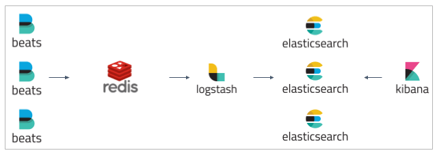

# elk-redis


ELK Stack with Redis as buffer.


## Resources available
- [elk-sample](https://github.com/aleroxac/elk-sample) files(with some changes)
- filebeat
- redis


## Setup
``` shell
## Installing Docker
curl -fsSL https://get.docker.com | bash

### Installing docker-compose
sudo curl -L "https://github.com/docker/compose/releases/download/1.27.4/docker-compose-$(uname -s)-$(uname -m)" -o /usr/local/bin/docker-compose
sudo chmod +x /usr/local/bin/docker-compose
```


## Use mode
``` sh
## Running the docker-compose
docker-compose up -d

### Viewing messages inside redis container
docker-compose exec redis redis-cli lrange input_key 0 0
docker-compose exec redis redis-cli lrange output_key 0 0

### Restarting index process
assets/scripts/restart apache
```